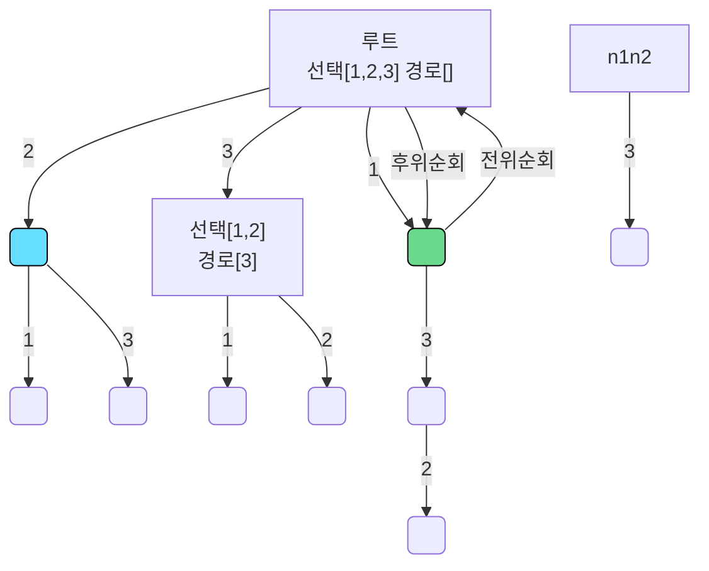

## backtracking (최장 증가 부분 수열)

### 정의
> Ref : 
> 
> https://www.acmicpc.net/problem/15649
> 
> https://github.com/encrypted-def/basic-algo-lecture/blob/master/0x0C/15649.cpp





### 역추적 알고리즘의 수도코드
```

result = []
def backtrack(경로, 선택리스트):
    if 종료조건 만족:
        result.add
        return
    for 선택 in 선택리스트:
        선택하기
        backtrack(경로, 선택리스트)
        선택해제


for 선택 in 선택리스트:
    선택리스트에서 선택 제거
    경로.add(선택)

    backtrack(경로, 선택리스트)
    
    경로.remove(선택)
    선택을 선택리스트로 복원


```
