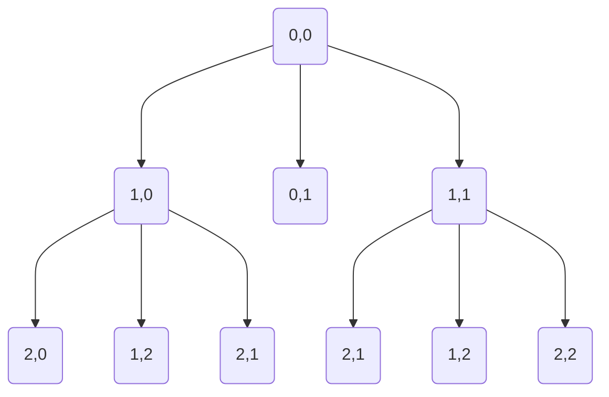

## 편집거리 edit-distance

### 정의

> 두 문자열 A와 B가 주어졌을 때, A에 연산을 최소 횟수로 수행해 B로 만드는 문제를 "최소 편집" 문제라고 한다.
> 
> A에 적용할 수 있는 연산은 총 3가지가 있으며 아래와 같다.
> 
> 삽입: A의 한 위치에 문자 하나를 삽입한다.
> 삭제: A의 문자 하나를 삭제한다.
> 교체: A의 문자 하나를 다른 문자로 교체한다.
> 두 문자열이 주어졌을 때, 최소 편집 횟수를 구하는 프로그램을 작성하시오.
Ref : 
  - https://leetcode.com/problems/edit-distance/
  - https://www.techiedelight.com/ko/longest-common-subsequence/

---

### 입력

첫째 줄과 둘째 줄에 두 문자열이 주어진다. 
문자열은 알파벳 소문자로만 이루어져 있으며, 최대 1000글자로 이루어져 있다.


### 출력 

첫째 줄에 최소 편집 횟수를 출력한다.

| 번호 | 입력                 | 출력 |
| :--- | :------------------- | :--- |
| 1    | abc, ab              | 1    |
| 2    | ca, abc              | 3    |
| 3    | intension, execution | 4    |

---


### 점화식 세우기

두 문자 A,B 를 비교할때 3개의 패턴을 검사

A가 abc
B가 acc 라고 할때

f("abc", "acc") 의 결과값은 A와 같아야 한다.
따라서 A == B 로 정의 할수 있다.

그리고 추가는 Add 삭제는 Del 변경은 Trn로 정의하겠다.
아래식과 같이 추가 삭제 변경을 하더라도 원본과 같은 3글자를 보장해야한다.

3*(Del) + 3*(Add) = 3(Add+Del) | 3*Trn


> 만약 f("abc", "") 또는 f("", "acc") 라면 cost는 문자의길이인 3와 같다.
> 
> 만약 f("abc", "acc")의 마지막 문자열 e e가 일치하면 cost가 0이기 때문에 작업이 필요하지 않다.
> 
> 만약 일치 하지 않는다면 추가 삭제 변경중에 적은값이 cost이다.

  같지 않은 2번째 글자 b와 c를 비교할때 

  f("ab", "ac") ->
    Add는  f("ab$", "ac") == f("ab", "ac") //현재 가르키는 포인트가 2이므로 c는 제외
      -> A[i+1], B[j] == A[i], B[j-1] cost 1
    Del는 f("a", "ac")
      -> A[i-1], B[j]  cost 1
    Trn는 f("ab", "ac")
      -> A[i-1], B[j-1] cost 1

  MIN(
    f(i, j-1) + Add,
    f(i-1, j) + Del,
    f(i-1, j-1) + Trn)

```
Add,Del,Trn=1
  i a b c 
j 0 1 2 3
a 1 0 1 2
c 2 1 1 2
c 3 2 2 2
```

```
i=1, j=1
  -> cost 0
i=2, j=1
  -> f(2, 0) + Add = 2+1 = 3
  -> f(1, 1) + Del = 0+1 = 1
  -> f(1, 0) + Trn = 1+1 = 2
i=3, j=1
  -> f(3, 0) + Add = 3+1 = 4
  -> f(2, 1) + Del = 1+1 = 2
  -> f(2, 0) + Trn = 2+1 = 3
i=1, j=2
  -> f(1, 1) + Add = 0+1 = 1
  -> f(0, 2) + Del = 2+1 = 3
  -> f(0, 1) + Trn = 1+1 = 2
i=2, j=2
  -> f(2, 1) + Add = 1+1 = 2
  -> f(1, 2) + Del = 1+1 = 2
  -> f(1, 1) + Trn = 0+1 = 1
i=3, j=2
  -> f(3, 1) + Add = 2+1 = 3
  -> f(2, 2) + Del = 1+1 = 2
  -> f(2, 1) + Trn = 1+1 = 2
i=1, j=3
  -> f(1, 2) + Add = 1+1 = 2
  -> f(0, 3) + Del = 3+1 = 4
  -> f(1, 2) + Trn = 1+1 = 2
i=2, j=3
  -> f(2, 2) + Add = 1+1 = 2
  -> f(1, 3) + Del = 2+1 = 3
  -> f(1, 2) + Trn = 2+1 = 3
i=3, j=3
  -> f(3, 2) + Add = 2+1 = 3
  -> f(2, 3) + Del = 2+1 = 3
  -> f(2, 2) + Trn = 1+1 = 2
```


```
if A[i] == B[j] :
  cost = 0
else
  cost = MIN(
    1+DP[i][j-1], #Insert
    1+DP[i-1][j], #Delete
    1+DP[i-1][j-1]) #Transpose
```


### DP점화식
---

> Target X : execution
> 
> Input Y : extension
> 
| 번호   | 1    | 2    | 3       | 4       | 5       | 6       | 7    | 8    | 9    |
| ------ | ---- | ---- | ------- | ------- | ------- | ------- | ---- | ---- | ---- |
| X      | e    | x    | e       | c       | u       | t       | i    | o    | n    |
| Y      | e    | x    | t       | e       | n       | s       | i    | o    | n    |
| Action | skip | skip | replace | replace | replace | replace | skip | skip | skip |
| Result | e    | x    | e       | c       | u       | t       | i    | o    | n    |
결과 : 4 


```
  i 0 1 2 3 4 5 6
j - - E X E C U T I O N
0 - 0 0 0 0 0 0 0
1 E 0 0 1 1 1 1 1
2 X 0 1 1 2 2 2 2
3 T 0 1 1 2 2 2 3
4 E 0 1 2 2 2 2 3
5 N 0 2 2 3 3 3 3
6 S 0 2 2 3 3 4 4
7 I 0 2 2 3 3 4 4
8 O 0 2 2 3 3 4 4
9 N 0 2 2 3 3 4 4

```
i ABC
j EF

j기준 
  i -1 del  AB EF
  j -1 ins  ABC EF
  j-1 i-1 rep AB EF





### 구현

리트코드는 c++의경우 class를 사용하므로 동일하게 구현한다.
이때 클래스는 정적으로 할당한다.

Solution sol;

- ref : https://velog.io/@hidaehyunlee/CPP-01-클래스의-정적할당과-동적할당-new-delete

    